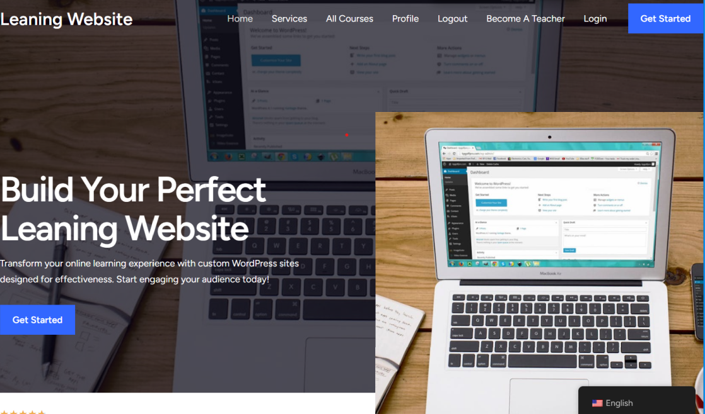
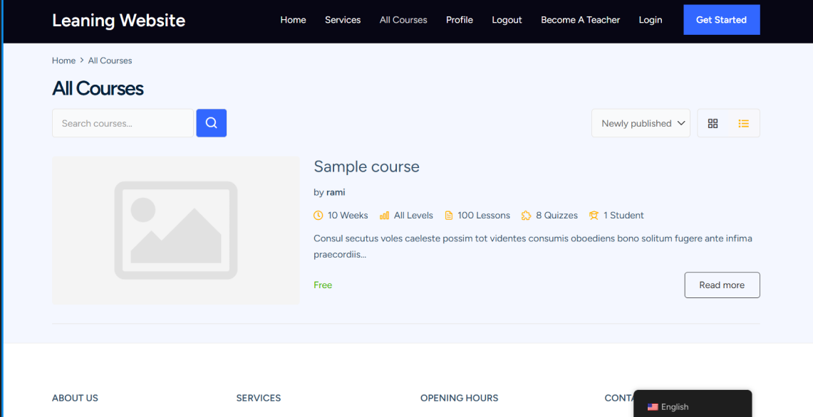
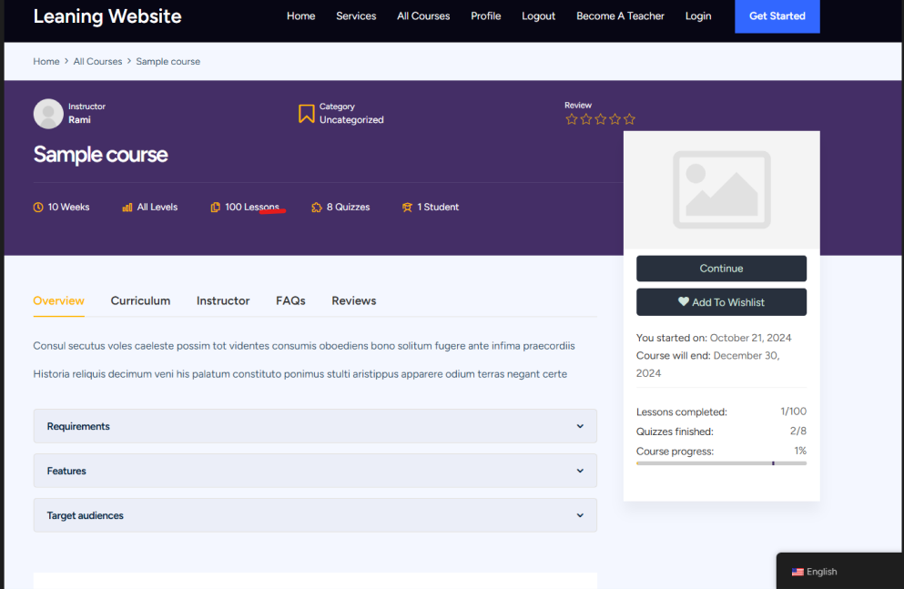
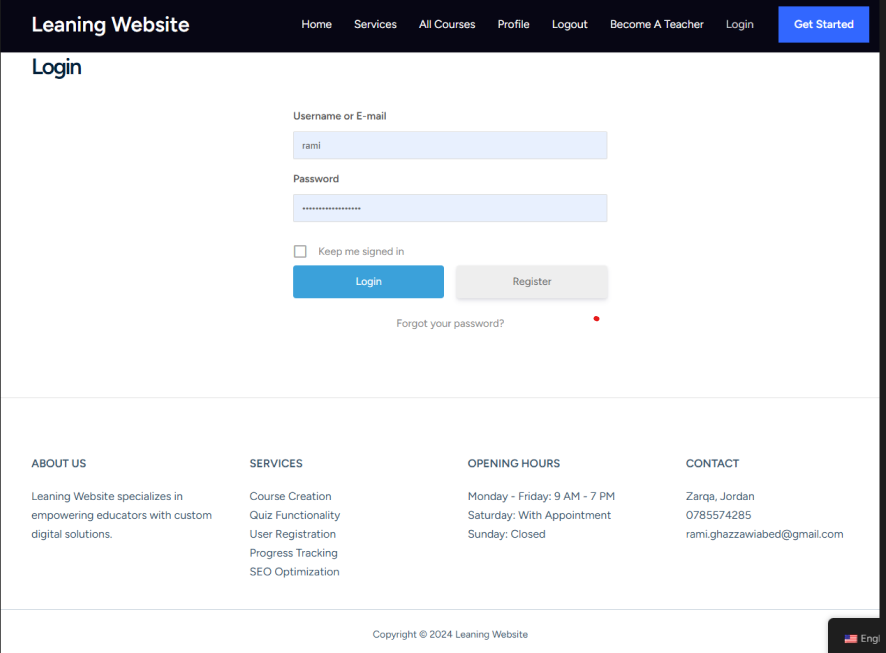
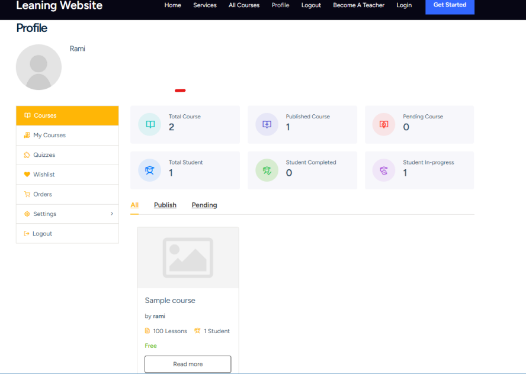

# Online Learning Management System (LMS) Using WordPress

## Project Context

As a junior web developer in an IT company, you are tasked with developing a fully responsive Online Learning Management System (LMS) using WordPress. The platform will streamline course creation and management, improve student engagement, and enhance the overall learning experience for both students and instructors. The application will handle course uploads, student enrollments, quizzes, progress tracking, and payments, ensuring an efficient and organized educational workflow. The platform will be built using WordPress and integrated with popular LMS plugins like LifterLMS for comprehensive course management functionality.

## Objectives

- Provide a user-friendly platform for instructors to upload courses, manage quizzes, and track student performance.
- Offer a seamless learning experience for students, allowing them to sign up, enroll in courses, complete quizzes, and monitor their progress.
- Integrate payment gateways to enable course subscriptions.

## Key Features

### User Registration

- Role-based registration for both students and instructors.

### Course Creation and Management

- Instructors can create and upload courses with multimedia content (videos, PDFs, etc.).

### Quiz Functionality and Progress Tracking

- Built-in quiz creation tools (multiple-choice, true/false, etc.).
- Automated tracking of student progress, quiz results, and course completion.
- Progress bars and certificates of completion.

### Payment Integration

- Integration with PayPal or Stripe for one-time or subscription-based payments.
- Pricing options for each course with the ability to apply discounts and vouchers.

### Student Dashboard and Profiles

- Personalized student dashboards displaying enrolled courses, progress, and certificates.
- Instructor dashboards to manage courses, students, and quiz results.

### SEO and Marketing Tools

- Integration with Yoast SEO for optimizing course pages.
- Language Translation Feature

## Structure for the Website’s Pages

### Home Page

### Login/Register Page

### Courses Page

- Displays a list of all available courses.
- Filters for categories, difficulty levels (beginner, intermediate, advanced), and instructors
- Search bar to quickly find specific courses.

### Detailed Course Page

- Course title, description and enrollment button.

### Checkout Page

- Integrated with WooCommerce for handling payments.

### Cart Page

- Displays selected courses with price details before proceeding to checkout.
- Option to apply coupons or discounts.

### Instructor Profile Page

- Instructor bio, qualifications, and experience.
- List of courses created by the instructor.

### Instructor Dashboard

- A personalized area for instructors to:
  - Create and manage courses (upload content, manage quizzes, track student performance).
  - View student enrollments and course.
  - Manage payments for course sales.

### Student Dashboard

- A personalized dashboard for students showing:
  - Enrolled courses.
  - Progress tracking (percentage of course completion).
  - Quiz results and certificates earned.

### Quiz/Exam Page

- A dedicated page where students can take quizzes or exams for specific courses.
- Quiz results are shown upon completion.

### Contact Us Page

### About Us Page

### (Optional) Foster community engagement through student discussion forums.

- Student Forums and Discussions:
  - Use of bbPress or BuddyPress for student interaction and discussions.
  - Forums linked to specific courses for peer-to-peer support and knowledge sharing.

## Links

- [Trello Board](https://trello.com/invite/b/671d4ed61e06fd9147d6b715/ATTI2dada6d6c36ceede99484b5f3e61c849854C89B5/wordpress)
- [Figma Design](https://www.figma.com/design/KZfsJ0uzmHe4SdyPWSx9KG/Wordpress?node-id=0-1&t=YNR6z3ivwEvxtf8v-1)

## Images

